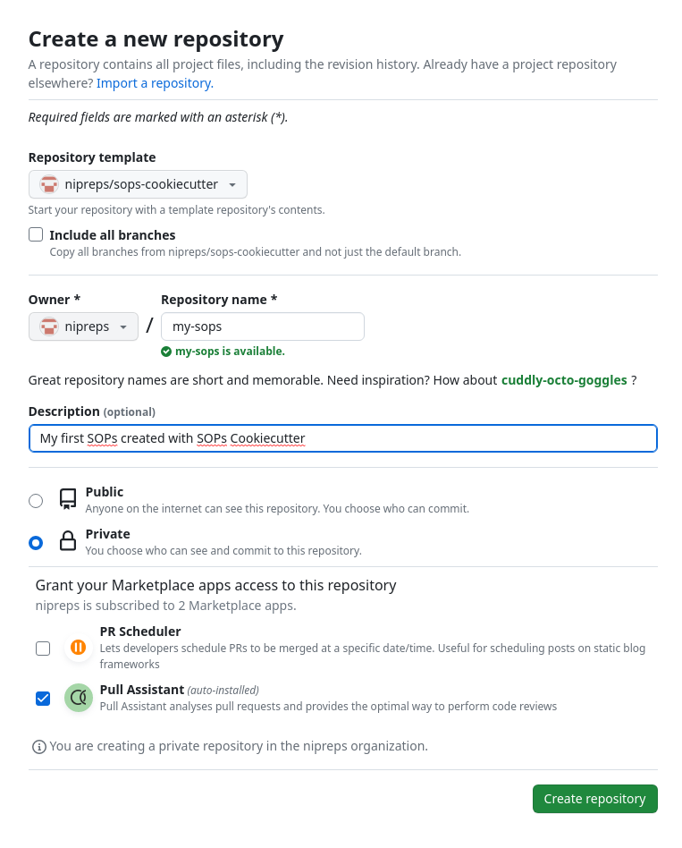

# *{{ settings.general.name }}*

Standard Operating Procedures (SOPs) bundle the documentation that describes the *nose-to-tail* execution of the experiment (that is, from data collection to final analysis), at an *atomic* level of detail, so that experiments can robustly be repeated.
Within your lab or your institution, the goal is that experimenters can carry out new data collection according to the overarching study plans with minimal supervision.
Beyond the doors of your lab or institution, SOPs are a critical tool to maximize the reproducibility of your research by others.

??? thanks "Thanks to Dr. Jo Etzel and to McKenzie P. Hagen"

    Thanks Jo, for seeding the ideas and demonstrating the importance of SOPs in our scientific endeavor and your excellent work in the dissemination of [the DMCC Project](https://mfr.osf.io/render?url=https://osf.io/6r9f8/?direct%26mode=render%26action=download%26mode=render) that includes SOPs we have reused as examples here.
    Thanks McKenzie, for lending your experience as an RA at Stanford to fill some of the early drafts of the acquisition examples and checklists.


## Why *{{ settings.general.name }}*?

*{{ settings.general.name }}* is a boilerplate for SOPs, and it provides a minimally working framework to bootstrap and continue your own SOPs.
SOPs typically should be a live documentation hub, the idea is that you iteratively build on top of previous versions.
Because this iterative advance of textual-formatted information is naturally handled by version control systems, we propose Git/GitHub as a convenient way of maintaining and working on this document.
This also permits many typical operations that implicitly happen with SOPs documents:

* *forking*: someone in an institution created an original SOPs document, which over time got copied over and child documents continued their lives;
* *branching*: one of those SOPs documents was evolved for a particular study that was almost like the original project, except for minimal differences;
* *merging*: a branch became important enough to become a constituent part of the original SOPs from which it derived; and
* *versioning*: it is critical to keep track of all changes in the SOPs, and even more important to take *snapshots* of the document at relevant milestones of its life cycle (e.g., *version - [ ]0*).

All of these operations are naturally part of Git.

## Publishing SOPs
Although very hardly other researchers will have access to the exact same settings detailed in your SOPs, they document all the incremental decisions that together implement your methods.
Therefore, making your SOPs accessible alongside datasets and publications is an effective way of maximizing the transparency of your research.
Indeed, opening your SOPs will ensure all procedural details of you experiment are preserved with the results.

!!! danger "SOPs generated from *{{ settings.general.name }}* CAN BE PRIVATE"

     *{{ settings.general.name }}* does not enforce the public release of your SOPs.
     Leveraging the authorization system and access permissions of Git, you have full control over who can access your SOPs.
     Indeed, most projects cannot share their SOPs open until the study has been concluded for a number of reasons.

     If you are using *{{ settings.general.name }}* with GitHub, you only need to make sure you generate your new SOPs in **private** mode or change it to private after creation (see below).


## How to use this template

### Step 1: derive your own repository from the template

!!! abstract "SOPs :heart: checklists"

    Checklists are very effective in ensuring all the steps of a procedure are followed to the letter, thereby minimizing the chance of misshapen.


- [ ] Click on the "Use this template" button in the home page of [`{{ settings.general.repo }}`](https://github.com/{{ settings.general.repo }}).
   Alternatively, you can use [this link](https://github.com/new?template_name=sops-cookiecutter&template_owner=nipreps).
   This will redirect you to the interface to create a new repository:
   
- [ ] You will land on the *Create a new repository* page:

      |  |
      |:--:|
      | Choose your `<user-or-institution>` as the owner of the new repository, and give it a name (for instance, we called the new SOPs document *my-sops*. Although it is optional, adding a description is recommended. |

- [ ] Check on the public/private status of the repository - you might not want to have your SOPs public until the study is ready to do so.

    !!! warning "Make sure you choose the appropriate visibility, however you may change it at a later time."

### Step 2: updating contents

!!! info "At this point, you can use Git and GitHub as for any other projects."

- [ ] The documentation will be found under the `docs/` folder.
- [ ] Although you can edit your SOPs online in your repository, you probably enjoy more flexibility if you install them locally:

    !!! warning "Replace *my-sops* below with the actual name of your repository."

    ```
    cd $HOME/projects/
    git clone git@github.com:<user-or-institution>/my-sops.git
    cd my-sops
    ```


- [ ] Check locally how your new documents will render:
    - [ ] Install the rendering software (called `mkdocs`) and dependencies by running:
       ```
       pip install -r requirements.txt
       ```
    - [ ] Run the local web server
       ```
       mkdocs serve
       ```
    - [ ] Open a browser and go to the URL stated by the output of the previous command, which reads like:
       ```
       INFO     -  [08:53:36] Serving on http://127.0.0.1:8000/my-sops/
       ```
- [ ] Now you are ready to revise each of the documents, editing and updating accordingly to your experiments:
    - [ ] Update the project's name, description, authors, etc. at the head of the `/mkdocs.yml` file.
    - [ ] Update the project's name and introduction in the `docs/index.md` file.
    - [ ] Customize everything to fit your needs.
    - [ ] Commit your changes and push back to repository:
       ```
       git commit -am "Updated the recruitment procedures with a new e-mail template"
       git push
       ```

## Project settings
You may want to keep certain settings constant throughout the SOPs, for instance, the length of a specific stimulus in a particular point of the experiment which keeps appearing in the documentation at several spots.
To maintain documentation-wise information, define these metadata in the `study-settings.yml` file.
For example:
``` yaml title="Example of settings file"

```

Given the above settings file, if we want our SOPs to show the name of the project (*My SOPs*), then we will have to use the following replacement code `{{ '{{ settings.general.name }}' }}` wherever the replacement is necessary.

## Protecting sensitive and proprietary information

Some metadata MUST remain private at all times.
If you want to keep secrets that are inaccessible to others (even after making the SOPs open by changing their visibility), the easiest (and yet secure) way of achieving this is initiating a private repository with a config file for the private metadata.

- [ ] Create a [new repository on GitHub](https://docs.github.com/en/get-started/quickstart/create-a-repo). **Make sure the repository IS PRIVATE**.
- [ ] In the new repository, **ONLY one file should be found** at the root: `secrets.yml`.
     That file will look as follows:

``` yaml title="Example of configuration file storing private information"

```

- [ ] Copy the URL of the new repository.
    This will, typically, take a form like `https://github.com/gh_handle/my-sops-secrets.git`, where `gh_handle` is a GitHub username and `my-sops-secrets` is the name of the repository you set when you started the secrets repository.
    With the URL, please [add a git submodule](https://github.blog/2016-02-01-working-with-submodules/) to the repo:

    ``` bash title="Make sure your URL is followed by the word 'secrets'"
    git submodule add https://github.com/gh_handle/my-sops-secrets.git secrets
    ```

- [ ] Finally, uncomment the line pointing at `secrets/settings.yml` in *plugins* section of the `/mkdocs.yml` general configuration file:

``` yaml title="Enabling private metadata"

```

- [ ] From this moment on, you can use these secrets with the following replacement pattern: `{{ '{{ secrets.logins.password_computer1 | default("*****") }}' }}`.
    The default filter allows the replacement of unavailable secrets (because in this case the user does not have access to the secret) with redaction symbols.
    For example, using `{{ '{{ secrets.logins.password_computer1 | default("*****") }}' }}` at this point produces a series of stars `{{ secrets.logins.password_computer1 | default("*****") }}` to indicate that a secret could not be accessed at this point.

!!! warning "To ensure your secrets are not exposed, you just need to protect the git submodule"

    Now private information is accessible only for users who have access to the submodule, and they will need to explicitly add the submodule for the secrets to be rendered.

??? important "Examples showing how to use secrets"

    The *secrets* feature is demonstrated within these SOPs (see [Example 2 in the recruitment section](recruitment-scheduling-screening/example2.md#scheduling), where phone numbers, e-mail addresses, and names are redacted).

    The [corresponding code](https://github.com/nipreps/sops-cookiecutter/blob/2569b8a091cce3080536eb337e151b87aa6b74cd/docs/recruitment-scheduling-screening/example2.md) is available on the GitHub repository

## Snapshotting the documentation for archival and dissemination

Whenever you feel ready to make a *snapshot* of the current state of your SOPs and assign them a new *version* label, the repository you cloned has the tooling to do so easily in a single step.

- [ ] Create a release on your GitHub repository.
   The creation of the release will trigger an automation (using GitHub Actions).
   This automation will inspect all changes since the last *release* you created and add them to the `docs/changes.md` document, which keeps human-readable track of the evolution of the SOPs.

!!! info "Choosing appropriate version numbers"
    We recommend to use the [Calendar Versioning (CalVer) system](https://calver.org) for your SOPs.
    Therefore, the first number of your version (the so-called *major* section) will always be the year when the version is created (e.g., *22.XX.YY* or *2022.XX.YY*).
    The second and third components (*XX* and *YY*) are suggested as follows:
    - Modify the *minor* component (*XX*) whenever there are large changes in your documents that make your SOPs substantially different from a previous version.
    - Modify the *patch* component (*YY*) whenever there are small changes like typos, reordering, planned iterations, etc. that you want to record as relevant steps, but basically do not change the SOPs in a substantial manner.
    One final recommendation is to only set the *minor* (*XX*) above zero when your SOPs are *ready for production*.
    In other words, keep *XX* with zero (e.g., *2022.0.YY*) during the process of developing your SOPs before the study starts.
    Then change *XX* to one before you run the first data collection session following the SOPs (e.g., create the version *2022.1.1* right before the first time you will use your SOPs)
